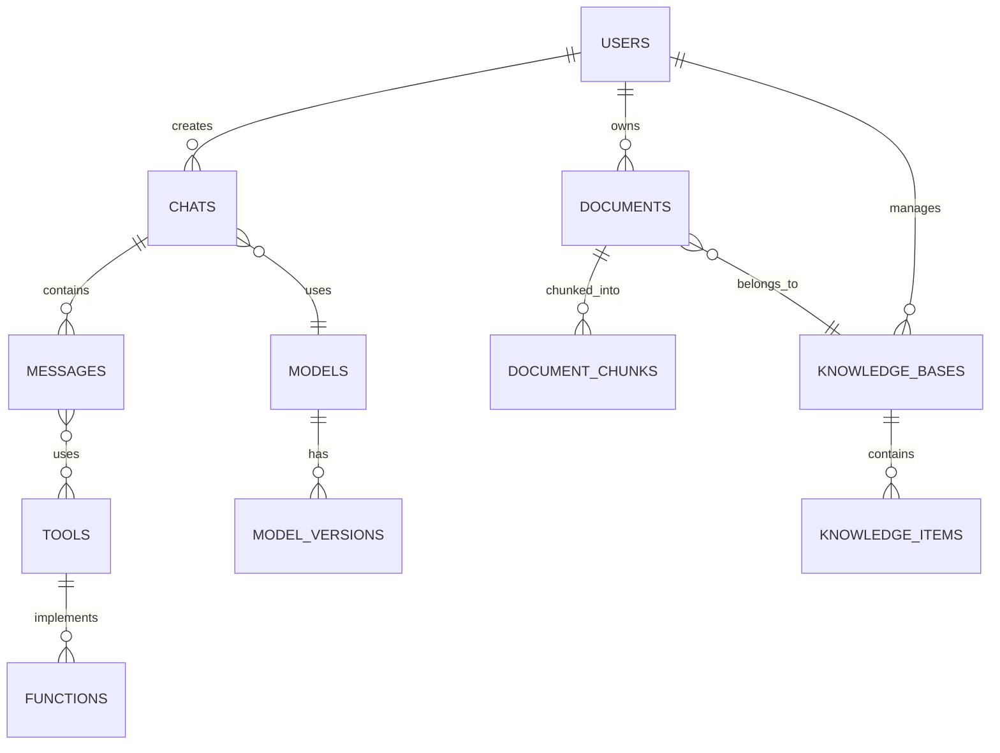

# Open WebUI - Technical Design Document

## Project Overview

Open WebUI is a comprehensive web-based user interface for interacting with AI models, particularly designed to work with Ollama and other AI backends. This document provides a detailed technical analysis of the project structure, architecture, and features.

## Technology Stack

### Frontend
- **Framework**: SvelteKit (based on .svelte files and svelte.config.js)
- **Styling**: Tailwind CSS with container queries and typography support
- **Language**: TypeScript with full type checking
- **Build Tool**: Vite with hot module replacement
- **UI Components**: Rich text editor (TipTap), code editor (CodeMirror), flow diagrams (XYFlow)
- **State Management**: Native Svelte stores
- **Internationalization**: i18next with automatic parsing
- **Markdown**: Marked with KaTeX and syntax highlighting
- **WebSocket**: Socket.IO client for real-time features
- **PWA Support**: Full Progressive Web App capabilities

### Backend
- **Framework**: FastAPI with WebSocket support
- **Database**: SQLAlchemy ORM with migrations
- **Authentication**: JWT, OAuth providers, LDAP support
- **WebSocket**: Socket.IO for real-time communication
- **File Processing**: Multiple document loaders and processors
- **Caching**: Redis with sentinel support
- **Task Queue**: Background task processing
- **Telemetry**: OpenTelemetry integration

### AI Integration
- **Model Support**:
  - Ollama integration
  - OpenAI API compatibility
  - Azure OpenAI integration
  - Direct model connections
- **Features**:
  - Text generation
  - Chat completion
  - Image generation
  - Audio processing (TTS/STT)
  - Code execution
  - RAG (Retrieval Augmented Generation)

### DevOps
- **Containerization**: Docker with multi-stage builds
- **Orchestration**: Kubernetes with Helm charts
- **GPU Support**: NVIDIA and AMD GPU configurations
- **Testing**: Cypress for E2E testing
- **CI/CD**: GitHub Actions ready

## Project Structure Analysis

### Root Directory Files
- Configuration files for various tools (ESLint, Prettier, Git)
- Docker and deployment configurations
- Build and run scripts
- Documentation files (README.md, INSTALLATION.md, etc.)

### Key Directories

#### `/backend/`
The Python backend implementation containing:
- `open_webui/` - Main backend application code
- API endpoints and business logic
- WebSocket implementation for real-time features
- Static file serving
- Database migrations and utilities

#### `/src/`
The frontend SvelteKit application:
- `routes/` - Page components and routing
- `lib/` - Shared components, utilities, and stores
- `app.html` - Main HTML template
- Styling files (CSS, Tailwind)

#### `/static/`
Static assets including:
- Images and icons
- Fonts (multiple font families)
- Audio files (notifications, greetings)
- Emoji SVG files
- Theme CSS files
- PWA manifest and icons

#### `/cypress/`
End-to-end testing suite with tests for:
- Chat functionality
- Document management
- User registration
- Settings

#### `/kubernetes/`
Kubernetes deployment configurations:
- Helm charts
- Manifest files for different deployment scenarios
- GPU support configurations

## Core Features Analysis

### 1. Chat Interface
- Real-time messaging with AI models via WebSocket
- Message history and conversation threading
- Rich text formatting with Markdown support
- Code highlighting and execution
- File attachments and media support
- Voice input/output capabilities
- Context-aware responses
- Conversation export/import

### 2. AI Model Integration
- Ollama model management and deployment
- OpenAI API compatibility layer
- Azure OpenAI service integration
- Direct model connections
- Model performance monitoring
- Custom model configurations
- Temperature and parameter controls
- Response streaming

### 3. Document Management
- Multi-format file upload (PDF, DOCX, TXT, etc.)
- Document OCR and text extraction
- Automatic content chunking
- Vector-based similarity search
- Full-text search capabilities
- Document version control
- Access permissions management
- Web page import and processing

### 4. Knowledge Management
- RAG (Retrieval Augmented Generation)
- Document embeddings generation
- Semantic search functionality
- Knowledge base organization
- Custom collection management
- Citation and source tracking
- Content relevancy scoring
- Hybrid search capabilities

### 5. User System
- Role-based access control (RBAC)
- OAuth provider integration
- LDAP authentication support
- API key management
- User preferences storage
- Activity history tracking
- Usage quotas and limits
- Profile customization

### 6. Tools & Functions
- Custom function definitions
- External API integrations
- Code execution sandbox
- Tool chaining capabilities
- Function parameter validation
- Error handling and logging
- Rate limiting and quotas
- Usage analytics

### 7. Administration
- User management interface
- System configuration panel
- Usage monitoring and analytics
- Audit logging and tracking
- Backup and restore capabilities
- Model deployment management
- Resource allocation control
- System health monitoring

### 8. Workspace Features
- Customizable layouts
- Tool integration framework
- Knowledge base management
- Prompt template library
- Model configuration interface
- File organization system
- Search and filter capabilities
- Sharing and collaboration tools

## Technical Architecture

### Frontend Architecture
- **Component Structure**:
  - SvelteKit-based routing and layouts
  - Reusable UI component library
  - Atomic design principles
  - Responsive and accessible design

- **State Management**:
  - Svelte stores for global state
  - Context API for component trees
  - Persistent storage with IndexedDB
  - Real-time sync via WebSocket

- **Performance Optimizations**:
  - Code splitting and lazy loading
  - Asset optimization and caching
  - Service worker for offline support
  - Virtual scrolling for large lists

- **UI/UX Features**:
  - Dark/light theme support
  - Responsive layouts
  - Keyboard navigation
  - Accessibility compliance
  - Error boundary handling

### Backend Architecture
- **API Layer**:
  - RESTful endpoints with OpenAPI specs
  - WebSocket server for real-time events
  - GraphQL support for complex queries
  - Rate limiting and throttling

- **Service Layer**:
  - Modular service architecture
  - Dependency injection pattern
  - Background task processing
  - Caching strategies

- **Data Layer**:
  - SQLAlchemy ORM models
  - Migration management
  - Connection pooling
  - Query optimization

- **Integration Layer**:
  - Model provider adapters
  - External service connectors
  - Plugin system
  - Webhook management

### Security Architecture
- **Authentication**:
  - JWT token management
  - OAuth 2.0 integration
  - LDAP authentication
  - API key validation

- **Authorization**:
  - Role-based access control
  - Resource-level permissions
  - Token scope validation
  - Rate limiting

- **Data Protection**:
  - Input validation
  - XSS prevention
  - CSRF protection
  - SQL injection prevention
  - Data encryption

### Infrastructure Architecture
- **Containerization**:
  - Multi-stage Docker builds
  - Container optimization
  - Resource management
  - Health monitoring

- **Orchestration**:
  - Kubernetes deployment
  - Service scaling
  - Load balancing
  - Resource allocation
  - High availability setup

- **Storage**:
  - Persistent volumes
  - Object storage
  - Backup systems
  - Data replication

- **Monitoring**:
  - OpenTelemetry integration
  - Performance metrics
  - Error tracking
  - Usage analytics

### Development Architecture
- **Local Development**:
  - Hot reload setup
  - Development containers
  - Mock services
  - Debug tooling

- **Testing Strategy**:
  - Unit testing framework
  - Integration testing
  - E2E testing with Cypress
  - Performance testing

- **CI/CD Pipeline**:
  - Automated builds
  - Test automation
  - Deployment automation
  - Environment management

- **Code Quality**:
  - Linting and formatting
  - Type checking
  - Code review process
  - Documentation generation

---

## Windows 11 Development Setup Guide

### System Requirements
- Windows 11 Pro, Enterprise, or Education (for WSL2 support)
- 8GB RAM minimum (16GB+ recommended)
- 100GB free disk space
- Processor with virtualization support

### Initial Setup

1. **Enable Windows Features**:
   ```powershell
   # Enable Windows Subsystem for Linux and Virtual Machine Platform
   dism.exe /online /enable-feature /featurename:Microsoft-Windows-Subsystem-Linux /all /norestart
   dism.exe /online /enable-feature /featurename:VirtualMachinePlatform /all /norestart
   ```

2. **Install WSL2**:
   ```powershell
   # Install WSL2 with Ubuntu
   wsl --install -d Ubuntu
   
   # Set WSL2 as default
   wsl --set-default-version 2
   ```

3. **Install Development Tools**:
   - [Git for Windows](https://git-scm.com/download/win)
   - [Visual Studio Code](https://code.visualstudio.com/)
   - [Docker Desktop](https://www.docker.com/products/docker-desktop)
   - [Node.js LTS](https://nodejs.org/)
   - [Python 3.8+](https://www.python.org/downloads/)

4. **Configure Git**:
   ```bash
   git config --global user.name "Your Name"
   git config --global user.email "your.email@example.com"
   ```

### Project Setup

1. **Clone Repository**:
   ```bash
   # Create development directory
   mkdir C:\DEV
   cd C:\DEV
   
   # Clone repository
   git clone https://github.com/open-webui/open-webui
   cd open-webui
   ```

2. **Install Node Dependencies**:
   ```bash
   # Install npm packages
   npm install
   ```

3. **Setup Python Environment**:
   ```bash
   # Create virtual environment
   python -m venv venv
   
   # Activate virtual environment
   .\venv\Scripts\activate
   
   # Install requirements
   pip install -r backend\requirements.txt
   ```

4. **Configure Environment**:
   ```bash
   # Copy example environment file
   copy .env.example .env
   
   # Edit .env file with your settings
   code .env
   ```

### Running the Application

1. **Start Backend Server**:
   ```bash
   # In one terminal
   .\venv\Scripts\activate
   cd backend
   python -m uvicorn open_webui.main:app --reload
   ```

2. **Start Frontend Development Server**:
   ```bash
   # In another terminal
   npm run dev
   ```

3. **Access the Application**:
   - Frontend: http://localhost:3000
   - Backend API: http://localhost:8000
   - API Documentation: http://localhost:8000/docs

### Docker Setup (Alternative)

1. **Configure Docker Desktop**:
   - Open Docker Desktop
   - Go to Settings > Resources
   - Allocate at least 4GB RAM
   - Enable WSL2 integration

2. **Run with Docker Compose**:
   ```bash
   # Start services
   docker compose up -d
   
   # View logs
   docker compose logs -f
   ```

### IDE Configuration

1. **VS Code Extensions**:
   ```bash
   # Install recommended extensions
   code --install-extension svelte.svelte-vscode
   code --install-extension ms-python.python
   code --install-extension dbaeumer.vscode-eslint
   code --install-extension esbenp.prettier-vscode
   ```

2. **VS Code Settings**:
   ```json
   {
     "editor.formatOnSave": true,
     "editor.defaultFormatter": "esbenp.prettier-vscode",
     "python.formatting.provider": "black",
     "python.linting.enabled": true,
     "python.linting.pylintEnabled": true
   }
   ```

### Troubleshooting

1. **WSL Issues**:
   ```powershell
   # Reset WSL
   wsl --shutdown
   wsl --unregister Ubuntu
   wsl --install -d Ubuntu
   ```

2. **Docker Issues**:
   ```powershell
   # Reset Docker Desktop
   wsl --shutdown
   net stop com.docker.service
   net start com.docker.service
   ```

3. **Port Conflicts**:
   ```powershell
   # Find process using port
   netstat -ano | findstr :3000
   netstat -ano | findstr :8000
   
   # Kill process
   taskkill /PID <process_id> /F
   ```

### Development Tips

1. **Hot Reload**:
   - Frontend changes automatically reload
   - Backend changes trigger uvicorn reload
   - Database changes require manual restart

2. **Testing**:
   ```bash
   # Run frontend tests
   npm run test
   
   # Run backend tests
   pytest backend/tests
   
   # Run e2e tests
   npm run cy:open
   ```

3. **Debugging**:
   - Use VS Code's debugger for Python
   - Use Chrome DevTools for frontend
   - Check Docker logs for service issues

## Deployment and Configuration Guide

### Environment Setup

#### Development Environment
1. **Prerequisites**:
   - Node.js (>=18.13.0)
   - Python (>=3.8)
   - Docker and Docker Compose
   - Git

2. **Local Setup**:
   ```bash
   # Clone repository
   git clone https://github.com/open-webui/open-webui
   cd open-webui

   # Install dependencies
   npm install
   pip install -r backend/requirements.txt

   # Start development servers
   npm run dev          # Frontend
   ./backend/dev.sh     # Backend
   ```

#### Production Environment
1. **System Requirements**:
   - CPU: 4+ cores recommended
   - RAM: 8GB minimum, 16GB+ recommended
   - Storage: 20GB+ for base system
   - GPU: Optional, for model acceleration

2. **Dependencies**:
   - Docker Engine
   - Docker Compose
   - NVIDIA Container Runtime (for GPU support)

### Deployment Options

#### Docker Deployment
1. **Basic Setup**:
   ```bash
   docker compose up -d
   ```

2. **GPU-Enabled Setup**:
   ```bash
   docker compose -f docker-compose.gpu.yaml up -d
   ```

3. **Custom Configuration**:
   ```bash
   # Copy example env file
   cp .env.example .env
   
   # Edit configuration
   vi .env
   
   # Deploy with custom config
   docker compose up -d
   ```

#### Kubernetes Deployment
1. **Using Helm**:
   ```bash
   cd kubernetes/helm
   helm install open-webui ./chart
   ```

2. **Using Raw Manifests**:
   ```bash
   kubectl apply -k kubernetes/manifest/base
   ```

3. **GPU Support**:
   ```bash
   kubectl apply -k kubernetes/manifest/gpu
   ```

### Configuration Guide

#### Core Settings
1. **Authentication**:
   ```env
   WEBUI_AUTH=true
   WEBUI_JWT_SECRET_KEY=your-secret-key
   ENABLE_SIGNUP=true
   ENABLE_OAUTH=true
   ```

2. **Model Integration**:
   ```env
   ENABLE_OLLAMA_API=true
   OLLAMA_BASE_URL=http://ollama:11434
   ENABLE_OPENAI_API=false
   ```

3. **Features**:
   ```env
   ENABLE_CHANNELS=true
   ENABLE_NOTES=true
   ENABLE_IMAGE_GENERATION=true
   ENABLE_CODE_EXECUTION=true
   ```

#### Advanced Configuration

1. **Performance Tuning**:
   ```env
   THREAD_POOL_SIZE=8
   RAG_EMBEDDING_BATCH_SIZE=32
   CHUNK_SIZE=1500
   CHUNK_OVERLAP=200
   ```

2. **Security Settings**:
   ```env
   CORS_ALLOW_ORIGIN=["http://localhost:3000"]
   ENABLE_API_KEY=true
   ENABLE_ADMIN_CHAT_ACCESS=false
   ```

3. **Storage Configuration**:
   ```env
   REDIS_URL=redis://redis:6379
   UPLOAD_DIR=/app/backend/uploads
   ```

### Monitoring and Maintenance

#### Health Checks
1. **Backend Health**:
   ```bash
   curl http://localhost:8080/health
   curl http://localhost:8080/health/db
   ```

2. **Frontend Health**:
   ```bash
   curl http://localhost:3000
   ```

#### Logging
1. **Container Logs**:
   ```bash
   docker compose logs -f webui
   docker compose logs -f ollama
   ```

2. **Application Logs**:
   ```env
   GLOBAL_LOG_LEVEL=info
   AUDIT_LOG_LEVEL=info
   ```

#### Backup Procedures
1. **Database Backup**:
   ```bash
   docker compose exec db pg_dump -U postgres > backup.sql
   ```

2. **File Backup**:
   ```bash
   tar -czf uploads.tar.gz /path/to/upload/dir
   ```

### Scaling Considerations

#### Horizontal Scaling
1. **Frontend**:
   - Deploy multiple replicas
   - Use load balancer
   - Configure session affinity

2. **Backend**:
   - Scale API servers independently
   - Use Redis for session storage
   - Configure connection pooling

#### Resource Scaling
1. **CPU/Memory**:
   ```yaml
   resources:
     limits:
       cpu: "2"
       memory: "4Gi"
     requests:
       cpu: "500m"
       memory: "1Gi"
   ```

2. **Storage**:
   ```yaml
   volumes:
     - name: data
       persistentVolumeClaim:
         claimName: open-webui-data
   ```

### Troubleshooting Guide

#### Common Issues
1. **Connection Issues**:
   - Check network connectivity
   - Verify service endpoints
   - Check firewall rules

2. **Performance Issues**:
   - Monitor resource usage
   - Check database queries
   - Analyze application logs

3. **Authentication Issues**:
   - Verify JWT configuration
   - Check OAuth settings
   - Validate user permissions

---

## Data Flows and Integration Patterns

### Chat Completion Flow
1. **User Input Processing**:
   - Message validation and sanitization
   - Context assembly from history
   - File attachment handling
   - Tool/function detection

2. **Model Interaction**:
   - Provider selection (Ollama/OpenAI/etc.)
   - Parameter configuration
   - Stream handling setup
   - Response processing

3. **Response Processing**:
   - Markdown rendering
   - Code block handling
   - Media content processing
   - Tool output formatting

### Document Processing Flow
1. **Upload Handling**:
   - File validation
   - Virus scanning
   - Size limit checking
   - Format detection

2. **Content Extraction**:
   - Text extraction by format
   - OCR for images/PDFs
   - Metadata extraction
   - Structure preservation

3. **Knowledge Integration**:
   - Content chunking
   - Embedding generation
   - Vector storage
   - Index updating

### Real-time Communication Flow
1. **WebSocket Management**:
   - Connection handling
   - Session management
   - Event routing
   - Reconnection logic

2. **Event Processing**:
   - Message serialization
   - State synchronization
   - Broadcast handling
   - Error recovery

### Integration Patterns
1. **Model Integration**:
   - Adapter pattern for providers
   - Configuration management
   - Response standardization
   - Error handling

2. **Storage Integration**:
   - Repository pattern
   - Caching strategies
   - Transaction management
   - Backup procedures

3. **External Services**:
   - API abstraction
   - Rate limiting
   - Circuit breaking
   - Retry logic

4. **Plugin System**:
   - Module loading
   - Dependency management
   - Configuration handling
   - Lifecycle management

---

## API Documentation

### Authentication Endpoints
- **POST** `/api/v1/auths/login`
  - Login with username/password
  - Returns JWT token
  - Body: `{ "username": string, "password": string }`

- **POST** `/api/v1/auths/register`
  - Register new user
  - Body: `{ "username": string, "email": string, "password": string }`

- **GET** `/api/v1/auths/me`
  - Get current user info
  - Requires: JWT token

### Chat Endpoints
- **POST** `/api/v1/chat/completions`
  - Generate chat completion
  - Body: `{ "model": string, "messages": Message[], "stream": boolean }`
  - Supports: streaming responses

- **GET** `/api/v1/chats`
  - List user's chat history
  - Query params: `limit`, `offset`

- **POST** `/api/v1/chats/{chat_id}/messages`
  - Add message to chat
  - Body: `{ "content": string, "role": "user"|"assistant" }`

### Model Management
- **GET** `/api/v1/models`
  - List available models
  - Query params: `provider`, `status`

- **POST** `/api/v1/models`
  - Create custom model
  - Body: Model configuration

- **PUT** `/api/v1/models/{model_id}`
  - Update model settings
  - Body: Updated configuration

### Document Management
- **POST** `/api/v1/files/upload`
  - Upload document
  - Multipart form data
  - Supports: PDF, DOCX, TXT, etc.

- **GET** `/api/v1/files`
  - List uploaded files
  - Query params: `type`, `limit`, `offset`

- **DELETE** `/api/v1/files/{file_id}`
  - Delete uploaded file

### Knowledge Base
- **POST** `/api/v1/knowledge`
  - Create knowledge base
  - Body: `{ "name": string, "description": string }`

- **POST** `/api/v1/knowledge/{kb_id}/documents`
  - Add documents to knowledge base
  - Multipart form data

- **GET** `/api/v1/knowledge/{kb_id}/search`
  - Search knowledge base
  - Query params: `q`, `limit`

### Tools & Functions
- **GET** `/api/v1/tools`
  - List available tools
  - Query params: `category`, `status`

- **POST** `/api/v1/tools`
  - Create custom tool
  - Body: Tool definition

- **POST** `/api/v1/functions`
  - Register custom function
  - Body: Function definition

### Administration
- **GET** `/api/v1/users`
  - List users (admin only)
  - Query params: `role`, `status`

- **PUT** `/api/v1/users/{user_id}`
  - Update user (admin only)
  - Body: User updates

- **GET** `/api/v1/configs`
  - Get system configuration
  - Requires: Admin access

### WebSocket Endpoints
- **WS** `/ws/socket.io`
  - Real-time communication
  - Events:
    - chat_message
    - status_update
    - model_update
    - error

### Response Formats

#### Success Response
```json
{
  "status": true,
  "data": {
    // Response data
  }
}
```

#### Error Response
```json
{
  "status": false,
  "error": {
    "code": "ERROR_CODE",
    "message": "Error description"
  }
}
```

### Authentication

All API endpoints (except login/register) require authentication using one of:

1. **JWT Token**
   ```http
   Authorization: Bearer <token>
   ```

2. **API Key**
   ```http
   X-API-Key: <api_key>
   ```

### Rate Limiting

- Default: 100 requests per minute
- Streaming endpoints: 10 concurrent connections
- File uploads: 50 MB per file, 500 MB total per hour

### Error Codes

- `AUTH_001`: Authentication failed
- `AUTH_002`: Token expired
- `AUTH_003`: Invalid credentials
- `RATE_001`: Rate limit exceeded
- `MODEL_001`: Model not found
- `MODEL_002`: Model error
- `FILE_001`: File too large
- `FILE_002`: Invalid file type

---

## Database Schema and Relationships

### Core Tables

#### Users
```sql
CREATE TABLE users (
    id UUID PRIMARY KEY,
    username VARCHAR(255) UNIQUE NOT NULL,
    email VARCHAR(255) UNIQUE NOT NULL,
    password_hash VARCHAR(255) NOT NULL,
    role VARCHAR(50) DEFAULT 'user',
    status VARCHAR(50) DEFAULT 'active',
    created_at TIMESTAMP DEFAULT CURRENT_TIMESTAMP,
    updated_at TIMESTAMP DEFAULT CURRENT_TIMESTAMP
);
```

#### Chats
```sql
CREATE TABLE chats (
    id UUID PRIMARY KEY,
    user_id UUID REFERENCES users(id),
    title VARCHAR(255),
    model VARCHAR(100),
    created_at TIMESTAMP DEFAULT CURRENT_TIMESTAMP,
    updated_at TIMESTAMP DEFAULT CURRENT_TIMESTAMP,
    status VARCHAR(50) DEFAULT 'active',
    settings JSONB
);
```

#### Messages
```sql
CREATE TABLE messages (
    id UUID PRIMARY KEY,
    chat_id UUID REFERENCES chats(id),
    role VARCHAR(50) NOT NULL,
    content TEXT NOT NULL,
    created_at TIMESTAMP DEFAULT CURRENT_TIMESTAMP,
    metadata JSONB,
    tokens INTEGER,
    rating INTEGER
);
```

### Model Management

#### Models
```sql
CREATE TABLE models (
    id VARCHAR(100) PRIMARY KEY,
    name VARCHAR(255) NOT NULL,
    provider VARCHAR(100) NOT NULL,
    status VARCHAR(50) DEFAULT 'active',
    config JSONB,
    created_at TIMESTAMP DEFAULT CURRENT_TIMESTAMP,
    updated_at TIMESTAMP DEFAULT CURRENT_TIMESTAMP
);
```

#### Model Versions
```sql
CREATE TABLE model_versions (
    id UUID PRIMARY KEY,
    model_id VARCHAR(100) REFERENCES models(id),
    version VARCHAR(100) NOT NULL,
    size BIGINT,
    sha256 VARCHAR(64),
    created_at TIMESTAMP DEFAULT CURRENT_TIMESTAMP,
    metadata JSONB
);
```

### Document Management

#### Documents
```sql
CREATE TABLE documents (
    id UUID PRIMARY KEY,
    user_id UUID REFERENCES users(id),
    filename VARCHAR(255) NOT NULL,
    mime_type VARCHAR(100),
    size BIGINT,
    created_at TIMESTAMP DEFAULT CURRENT_TIMESTAMP,
    metadata JSONB
);
```

#### Document Chunks
```sql
CREATE TABLE document_chunks (
    id UUID PRIMARY KEY,
    document_id UUID REFERENCES documents(id),
    content TEXT NOT NULL,
    embedding VECTOR(1536),
    metadata JSONB,
    created_at TIMESTAMP DEFAULT CURRENT_TIMESTAMP
);
```

### Knowledge Management

#### Knowledge Bases
```sql
CREATE TABLE knowledge_bases (
    id UUID PRIMARY KEY,
    name VARCHAR(255) NOT NULL,
    description TEXT,
    user_id UUID REFERENCES users(id),
    created_at TIMESTAMP DEFAULT CURRENT_TIMESTAMP,
    updated_at TIMESTAMP DEFAULT CURRENT_TIMESTAMP,
    settings JSONB
);
```

#### Knowledge Items
```sql
CREATE TABLE knowledge_items (
    id UUID PRIMARY KEY,
    kb_id UUID REFERENCES knowledge_bases(id),
    content TEXT NOT NULL,
    embedding VECTOR(1536),
    metadata JSONB,
    created_at TIMESTAMP DEFAULT CURRENT_TIMESTAMP
);
```

### Tools and Functions

#### Tools
```sql
CREATE TABLE tools (
    id UUID PRIMARY KEY,
    name VARCHAR(255) NOT NULL,
    description TEXT,
    type VARCHAR(100),
    config JSONB,
    created_at TIMESTAMP DEFAULT CURRENT_TIMESTAMP,
    updated_at TIMESTAMP DEFAULT CURRENT_TIMESTAMP
);
```

#### Functions
```sql
CREATE TABLE functions (
    id UUID PRIMARY KEY,
    name VARCHAR(255) NOT NULL,
    description TEXT,
    parameters JSONB,
    code TEXT,
    created_at TIMESTAMP DEFAULT CURRENT_TIMESTAMP,
    updated_at TIMESTAMP DEFAULT CURRENT_TIMESTAMP
);
```

### Relationships Diagram



### Key Relationships

1. **User Relationships**
   - One user can have many chats
   - One user can own many documents
   - One user can manage many knowledge bases

2. **Chat Relationships**
   - Each chat belongs to one user
   - Each chat uses one model
   - One chat can have many messages

3. **Document Relationships**
   - Each document is owned by one user
   - One document can have many chunks
   - Documents can belong to multiple knowledge bases

4. **Knowledge Base Relationships**
   - Each knowledge base has one owner
   - One knowledge base can have many items
   - Knowledge bases can contain multiple documents

5. **Tool Relationships**
   - Tools can implement multiple functions
   - Messages can use multiple tools
   - Tools can be used across different chats

### Indexing Strategy

1. **Primary Indexes**
   - All tables have UUID or VARCHAR primary keys
   - UUIDs used for high-volume tables
   - VARCHAR used for human-readable IDs

2. **Foreign Key Indexes**
   - All foreign key columns are indexed
   - Composite indexes for common joins

3. **Performance Indexes**
   ```sql
   -- Chat lookup by user
   CREATE INDEX idx_chats_user_id ON chats(user_id);
   
   -- Message lookup by chat
   CREATE INDEX idx_messages_chat_id ON messages(chat_id);
   
   -- Document lookup by user
   CREATE INDEX idx_documents_user_id ON documents(user_id);
   
   -- Vector similarity search
   CREATE INDEX idx_document_chunks_embedding ON document_chunks USING ivfflat (embedding vector_cosine_ops);
   ```

4. **Timestamp Indexes**
   ```sql
   -- Recent chat lookup
   CREATE INDEX idx_chats_created_at ON chats(created_at DESC);
   
   -- Message timeline
   CREATE INDEX idx_messages_created_at ON messages(created_at DESC);
   ```

### Data Integrity

1. **Foreign Key Constraints**
   - ON DELETE CASCADE for child records
   - ON DELETE RESTRICT for critical relationships

2. **Check Constraints**
   ```sql
   -- Valid email format
   ALTER TABLE users ADD CONSTRAINT valid_email
       CHECK (email ~* '^[A-Za-z0-9._%+-]+@[A-Za-z0-9.-]+\.[A-Za-z]{2,}$');
   
   -- Valid status values
   ALTER TABLE users ADD CONSTRAINT valid_status
       CHECK (status IN ('active', 'inactive', 'pending'));
   ```

3. **Unique Constraints**
   ```sql
   -- Unique usernames
   ALTER TABLE users ADD CONSTRAINT unique_username
       UNIQUE (username);
   
   -- Unique model versions
   ALTER TABLE model_versions ADD CONSTRAINT unique_model_version
       UNIQUE (model_id, version);
   ```

---

## Security Best Practices and Implementation

### Authentication Implementation

1. **JWT Token Management**
   ```python
   # Token generation with secure claims
   def generate_token(user_id: UUID) -> str:
       payload = {
           'sub': str(user_id),
           'exp': datetime.utcnow() + timedelta(days=1),
           'iat': datetime.utcnow(),
           'type': 'access'
       }
       return jwt.encode(payload, JWT_SECRET_KEY, algorithm='HS256')
   
   # Token validation with proper error handling
   def validate_token(token: str) -> dict:
       try:
           payload = jwt.decode(token, JWT_SECRET_KEY, algorithms=['HS256'])
           if payload['type'] != 'access':
               raise InvalidTokenError()
           return payload
       except jwt.ExpiredSignatureError:
           raise TokenExpiredError()
       except jwt.InvalidTokenError:
           raise InvalidTokenError()
   ```

2. **Password Security**
   ```python
   # Password hashing using Argon2
   def hash_password(password: str) -> str:
       return ph.hash(password)
   
   # Secure password verification
   def verify_password(password: str, hash: str) -> bool:
       try:
           return ph.verify(hash, password)
       except VerifyMismatchError:
           return False
   ```

### API Security

1. **Rate Limiting Implementation**
   ```python
   # Redis-based rate limiter
   async def rate_limit(key: str, limit: int, window: int) -> bool:
       async with redis.pipeline() as pipe:
           now = int(time.time())
           pipe.zremrangebyscore(key, 0, now - window)
           pipe.zcard(key)
           pipe.zadd(key, {str(now): now})
           pipe.expire(key, window)
           _, count, *_ = await pipe.execute()
           return count <= limit
   ```

2. **Input Validation**
   ```python
   # Pydantic model for request validation
   class ChatRequest(BaseModel):
       model: str
       messages: List[Message]
       temperature: Optional[float] = Field(ge=0, le=2)
       max_tokens: Optional[int] = Field(ge=1, le=4096)
       
       @validator('messages')
       def validate_messages(cls, v):
           if not v:
               raise ValueError('messages cannot be empty')
           return v
   ```

### Data Protection

1. **Encryption at Rest**
   ```python
   # File encryption using Fernet
   def encrypt_file(file_path: str, key: bytes) -> None:
       f = Fernet(key)
       with open(file_path, 'rb') as file:
           file_data = file.read()
       encrypted_data = f.encrypt(file_data)
       with open(file_path, 'wb') as file:
           file.write(encrypted_data)
   ```

2. **Secure File Handling**
   ```python
   # Secure file upload with validation
   async def handle_file_upload(file: UploadFile) -> str:
       # Validate file type
       if not allowed_file_type(file.filename):
           raise InvalidFileType()
           
       # Generate secure filename
       filename = secure_filename(file.filename)
       
       # Scan for malware
       if await virus_scan(file):
           raise MaliciousFileError()
           
       # Save with proper permissions
       path = os.path.join(UPLOAD_DIR, filename)
       with open(path, 'wb') as buffer:
           shutil.copyfileobj(file.file, buffer)
       os.chmod(path, 0o644)
       
       return filename
   ```

### XSS Prevention

1. **Content Security Policy**
   ```python
   # CSP middleware
   @app.middleware("http")
   async def add_csp_header(request: Request, call_next):
       response = await call_next(request)
       response.headers['Content-Security-Policy'] = (
           "default-src 'self'; "
           "script-src 'self' 'unsafe-inline' 'unsafe-eval'; "
           "style-src 'self' 'unsafe-inline'; "
           "img-src 'self' data: blob: https:; "
           "font-src 'self'; "
           "connect-src 'self' wss:;"
       )
       return response
   ```

2. **HTML Sanitization**
   ```python
   # Markdown rendering with sanitization
   def render_markdown(content: str) -> str:
       html = markdown.markdown(content)
       return bleach.clean(
           html,
           tags=ALLOWED_TAGS,
           attributes=ALLOWED_ATTRIBUTES,
           styles=ALLOWED_STYLES,
           protocols=ALLOWED_PROTOCOLS
       )
   ```

### CSRF Protection

1. **Token Generation**
   ```python
   # Generate CSRF token
   def generate_csrf_token() -> str:
       return secrets.token_urlsafe(32)
   
   # Validate CSRF token
   def validate_csrf_token(request: Request) -> bool:
       token = request.cookies.get('csrf_token')
       header_token = request.headers.get('X-CSRF-Token')
       return token and header_token and token == header_token
   ```

### Secure Headers

1. **Security Headers Middleware**
   ```python
   @app.middleware("http")
   async def add_security_headers(request: Request, call_next):
       response = await call_next(request)
       response.headers.update({
           'X-Frame-Options': 'DENY',
           'X-Content-Type-Options': 'nosniff',
           'X-XSS-Protection': '1; mode=block',
           'Strict-Transport-Security': 'max-age=31536000; includeSubDomains',
           'Referrer-Policy': 'strict-origin-when-cross-origin',
           'Permissions-Policy': 'geolocation=(), microphone=()'
       })
       return response
   ```

### Access Control

1. **Role-Based Access Control**
   ```python
   # Role-based permission decorator
   def require_role(roles: List[str]):
       def decorator(func):
           @wraps(func)
           async def wrapper(*args, **kwargs):
               user = get_current_user()
               if not user or user.role not in roles:
                   raise NotAuthorizedError()
               return await func(*args, **kwargs)
           return wrapper
       return decorator
   ```

2. **Resource Access Control**
   ```python
   # Resource ownership validation
   async def validate_resource_access(
       resource_id: UUID,
       user_id: UUID,
       required_permission: str
   ) -> bool:
       resource = await get_resource(resource_id)
       if not resource:
           return False
       
       # Check direct ownership
       if resource.user_id == user_id:
           return True
           
       # Check shared access
       access = await get_resource_access(resource_id, user_id)
       return access and access.permission >= required_permission
   ```

### Audit Logging

1. **Security Event Logging**
   ```python
   # Structured security event logger
   async def log_security_event(
       event_type: str,
       user_id: Optional[UUID],
       details: dict,
       severity: str = 'info'
   ):
       event = {
           'timestamp': datetime.utcnow().isoformat(),
           'event_type': event_type,
           'user_id': str(user_id) if user_id else None,
           'ip_address': request.client.host,
           'user_agent': request.headers.get('User-Agent'),
           'severity': severity,
           'details': details
       }
       await security_logger.log(event)
   ```

### Security Monitoring

1. **Failed Login Detection**
   ```python
   # Track failed login attempts
   async def track_failed_login(username: str, ip: str):
       key = f"failed_login:{username}:{ip}"
       count = await redis.incr(key)
       await redis.expire(key, 3600)  # 1 hour window
       
       if count >= 5:  # Threshold
           await block_ip(ip)
           await log_security_event(
               'excessive_failed_logins',
               None,
               {'username': username, 'ip': ip},
               'warning'
           )
   ```

2. **Suspicious Activity Detection**
   ```python
   # Monitor for suspicious patterns
   async def check_suspicious_activity(user_id: UUID, action: str):
       window = 300  # 5 minutes
       key = f"user_activity:{user_id}:{action}"
       
       count = await redis.incr(key)
       await redis.expire(key, window)
       
       if count > THRESHOLD_MAP[action]:
           await log_security_event(
               'suspicious_activity',
               user_id,
               {'action': action, 'count': count},
               'warning'
           )
           return True
       return False
   ```

---

*This document provides a high-level overview of the Open WebUI system. For detailed implementation specifics, please refer to the inline code documentation and API specifications.*